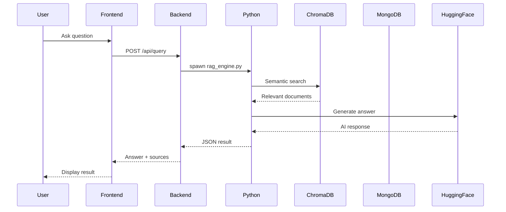

# ContextKeeper Developer Guide

Complete guide for developers working on ContextKeeper - an AI-powered knowledge management system for development teams.

## Table of Contents

- [Architecture Overview](#architecture-overview)
- [Technology Stack](#technology-stack)
- [Development Setup](#development-setup)
- [Code Organization](#code-organization)
- [Data Flow](#data-flow)
- [API Documentation](#api-documentation)
- [Database Schemas](#database-schemas)
- [Common Development Tasks](#common-development-tasks)
- [Testing](#testing)
- [Troubleshooting](#troubleshooting)

## Architecture Overview

ContextKeeper is a multi-tier application with frontend, backend, AI processing, and workflow orchestration layers.

### System Architecture

```
┌─────────────────────────────────────────────────────────────────┐
│                        User Interface Layer                     │
│                    (React + Vite + TypeScript)                  │
│  ┌──────────┬──────────┬──────────┬──────────┬──────────────┐  │
│  │  Query   │Knowledge │   AI     │  Branch  │     Sync     │  │
│  │Interface │  Graph   │ Agents   │ Selector │    Status    │  │
│  └──────────┴──────────┴──────────┴──────────┴──────────────┘  │
└────────────────────────┬────────────────────────────────────────┘
                         │ HTTP/REST (Port 5173 → 3000)
┌────────────────────────▼────────────────────────────────────────┐
│                      API Gateway Layer                          │
│                  (Express.js - Node.js)                         │
│  ┌──────────────────────────────────────────────────────────┐  │
│  │  REST API Endpoints (src/server.js)                      │  │
│  │  • Query, Knowledge Graph, Sync, Status                  │  │
│  │  • AI Agents, Branches, Config                           │  │
│  │  • Job Management, Decision Engine                       │  │
│  └──────────────────────────────────────────────────────────┘  │
└────────────────────────┬────────────────────────────────────────┘
                         │ child_process.spawn()
┌────────────────────────▼────────────────────────────────────────┐
│                   AI Processing Layer                           │
│                      (Python 3.9+)                              │
│  ┌─────────────────────┬──────────────────────────────────┐    │
│  │  Data Collectors    │      AI Agents                   │    │
│  │  • github_collector │  • github_agent                  │    │
│  │  • slack_collector  │  • slack_agent                   │    │
│  │  • notion_collector │  • notion_agent                  │    │
│  │  • rag_engine       │  • ai_summarizer                 │    │
│  │  • knowledge_graph  │  • decision_engine               │    │
│  └─────────────────────┴──────────────────────────────────┘    │
└────────────────────────┬────────────────────────────────────────┘
                         │
        ┌────────────────┴────────────────┐
        │                                 │
┌───────▼──────────┐            ┌─────────▼────────┐
│    MongoDB       │            │    ChromaDB      │
│  (Metadata &     │            │  (Vector Store)  │
│   Decisions)     │            │  Per Repo/Branch │
└──────────────────┘            └──────────────────┘
                         │
┌────────────────────────▼────────────────────────────────────────┐
│              Workflow Orchestration Layer                       │
│                    (Kestra + Docker)                            │
│  ┌──────────────────────────────────────────────────────────┐  │
│  │  Automated Workflows (YAML-based)                        │  │
│  │  • Data collection scheduling                            │  │
│  │  • AI analysis pipelines                                 │  │
│  │  • Multi-agent orchestration                             │  │
│  └──────────────────────────────────────────────────────────┘  │
└─────────────────────────────────────────────────────────────────┘
                         │
        ┌────────────────┴────────────────┐
        │                                 │
┌───────▼──────────┐            ┌─────────▼────────┐
│  External APIs   │            │   PostgreSQL     │
│  • GitHub API    │            │  (Kestra State)  │
│  • Slack API     │            └──────────────────┘
│  • Notion API    │
│  • Hugging Face  │
└──────────────────┘
```

### Component Interaction Flow



## Technology Stack

### Frontend
- **React 19**: UI library with hooks and functional components
- **TypeScript**: Type-safe JavaScript
- **Vite**: Fast build tool (ESBuild-based)
- **Bootstrap 5**: CSS framework
- **React Force Graph**: 2D/3D graph visualization
- **Three.js**: 3D rendering engine
- **React Markdown**: Markdown rendering

### Backend
- **Node.js 16+**: JavaScript runtime
- **Express.js**: Web framework
- **Mongoose**: MongoDB ODM
- **Axios**: HTTP client
- **CORS**: Cross-origin resource sharing
- **dotenv**: Environment variable management

### AI/ML Layer
- **Python 3.9+**: AI processing language
- **ChromaDB**: Vector database for embeddings
- **Hugging Face Hub**: AI model API
- **Sentence Transformers**: Text embeddings
- **PyGithub**: GitHub API wrapper
- **Slack SDK**: Slack API client
- **Notion Client**: Notion API wrapper

### Databases
- **MongoDB**: Document database for metadata
- **ChromaDB**: Vector database (per repository/branch)
- **PostgreSQL**: Kestra workflow state (optional)

### Orchestration
- **Kestra**: Workflow orchestration
- **Docker**: Containerization
- **Docker Compose**: Multi-container orchestration

## Development Setup

### Complete Setup from Scratch

#### 1. Prerequisites Installation

**Node.js:**
```bash
# Download from https://nodejs.org/ (v16+)
node --version  # Verify installation
npm --version
```

**Python:**
```bash
# Download from https://python.org/ (v3.9+)
python --version  # or python3 --version
pip --version
```

**MongoDB:**
```bash
# Option A: Local installation
# Download from https://www.mongodb.com/try/download/community

# Option B: MongoDB Atlas (cloud)
# Sign up at https://www.mongodb.com/cloud/atlas
```

**Docker (for Kestra):**
```bash
# Download from https://www.docker.com/products/docker-desktop
docker --version
docker-compose --version
```

#### 2. Clone Repository

```bash
git clone https://github.com/yadnyeshkolte/ContextKeeper.git
cd ContextKeeper
```

#### 3. Backend Setup

```bash
cd backend

# Install Node.js dependencies
npm install

# Create Python virtual environment
python -m venv venv

# Activate virtual environment
# Windows:
venv\Scripts\activate
# macOS/Linux:
source venv/bin/activate

# Install Python dependencies
pip install -r requirements.txt

# Configure environment
cp .env.example .env
# Edit .env with your API keys

# Start backend
npm start
```

#### 4. Frontend Setup

```bash
cd frontend

# Install dependencies
npm install

# Configure environment
cp .env.example .env
# Edit .env with backend URL

# Start development server
npm run dev
```

#### 5. Kestra Setup (Optional)

```bash
cd kestra

# Configure environment
cp .env.example .env
# Edit .env with API keys

# Start Kestra
docker-compose up -d

# Access UI at http://localhost:8080
```

### IDE Configuration

#### VS Code (Recommended)

**Extensions:**
- ESLint
- Prettier
- Python
- Pylance
- Docker
- MongoDB for VS Code

**settings.json:**
```json
{
  "editor.formatOnSave": true,
  "editor.codeActionsOnSave": {
    "source.fixAll.eslint": true
  },
  "python.linting.enabled": true,
  "python.linting.pylintEnabled": true,
  "python.formatting.provider": "black"
}
```

#### Debugging Configuration

**Backend (Node.js):**
```json
{
  "type": "node",
  "request": "launch",
  "name": "Backend Server",
  "program": "${workspaceFolder}/backend/src/server.js",
  "envFile": "${workspaceFolder}/backend/.env"
}
```

**Python Scripts:**
```json
{
  "type": "python",
  "request": "launch",
  "name": "RAG Engine",
  "program": "${workspaceFolder}/backend/scripts/rag_engine.py",
  "args": ["test question", "owner/repo", "main"],
  "console": "integratedTerminal"
}
```

## Code Organization

### Directory Structure

```
ContextKeeper/
├── backend/                    # Backend API and AI processing
│   ├── src/
│   │   └── server.js          # Express API server (990 lines)
│   ├── scripts/               # Python data collection scripts
│   │   ├── github_collector.py
│   │   ├── slack_collector.py
│   │   ├── notion_collector.py
│   │   ├── rag_engine.py
│   │   └── knowledge_graph_builder.py
│   ├── agents/                # Python AI agents
│   │   ├── base_agent.py
│   │   ├── github_agent.py
│   │   ├── slack_agent.py
│   │   ├── notion_agent.py
│   │   ├── ai_summarizer.py
│   │   └── decision_engine.py
│   ├── chroma/                # ChromaDB storage (auto-created)
│   ├── package.json
│   ├── requirements.txt
│   └── .env
├── frontend/                  # React frontend
│   ├── src/
│   │   ├── components/       # React components
│   │   │   ├── AIAgents.tsx
│   │   │   ├── AgentRunner.tsx
│   │   │   ├── KnowledgeGraph.tsx
│   │   │   ├── KnowledgeGraph3D.tsx
│   │   │   └── ...
│   │   ├── App.tsx           # Main app component
│   │   └── main.tsx          # Entry point
│   ├── public/
│   ├── package.json
│   └── .env
├── kestra/                    # Workflow orchestration
│   ├── flows/                # Workflow YAML files
│   ├── docker-compose.yml
│   └── .env
├── docs/                      # Documentation
│   ├── DEVELOPER_GUIDE.md    # This file
│   ├── api.md
│   ├── architecture.md
│   └── ...
└── README.md                  # Main documentation
```

### Naming Conventions

**Files:**
- React components: PascalCase (e.g., `KnowledgeGraph.tsx`)
- Python scripts: snake_case (e.g., `rag_engine.py`)
- Configuration files: lowercase (e.g., `package.json`)

**Variables:**
- JavaScript/TypeScript: camelCase (e.g., `apiUrl`)
- Python: snake_case (e.g., `api_key`)
- Constants: UPPER_SNAKE_CASE (e.g., `API_VERSION`)

**Functions:**
- JavaScript/TypeScript: camelCase (e.g., `fetchData()`)
- Python: snake_case (e.g., `collect_data()`)
- React components: PascalCase (e.g., `QueryInterface()`)

## Data Flow

### Query Processing Flow

```
1. User enters question in frontend
   ↓
2. Frontend sends POST /api/query
   ↓
3. Backend spawns rag_engine.py
   ↓
4. Python script:
   a. Loads ChromaDB collection for repo/branch
   b. Generates embedding for question
   c. Performs semantic search
   d. Retrieves top-k relevant documents
   e. Constructs context from documents
   f. Calls Hugging Face API with context + question
   g. Parses AI response
   h. Extracts sources, people, timeline
   ↓
5. Python returns JSON to backend
   ↓
6. Backend returns JSON to frontend
   ↓
7. Frontend displays answer with sources
```

### Data Collection Flow

```
1. User clicks "Sync Data" in frontend
   ↓
2. Frontend sends POST /api/sync-data
   ↓
3. Backend spawns github_collector.py
   ↓
4. Python script:
   a. Fetches commits from GitHub API
   b. Extracts metadata (message, author, files, etc.)
   c. Generates embeddings using Sentence Transformers
   d. Stores in ChromaDB collection (repo_branch format)
   e. Updates MongoDB with metadata
   ↓
5. Python returns success JSON
   ↓
6. Backend clears knowledge graph cache
   ↓
7. Backend returns success to frontend
   ↓
8. Frontend shows success message
```

### Knowledge Graph Generation Flow

```
1. User opens Knowledge Graph tab
   ↓
2. Frontend sends GET /api/knowledge-graph
   ↓
3. Backend checks cache (5-minute TTL)
   ↓
4. If cache miss, spawn knowledge_graph_builder.py
   ↓
5. Python script:
   a. Loads data from ChromaDB
   b. Extracts entities:
      - Commits (from commit messages)
      - Authors (from commit metadata)
      - Files (from changed files)
      - Technologies (from file extensions, imports)
      - Decisions (from commit messages with keywords)
   c. Creates relationships:
      - Author → Commit (authored)
      - Commit → File (modified)
      - File → Technology (uses)
      - Commit → Decision (decided)
   d. Assigns confidence scores
   e. Builds graph structure (nodes + links)
   ↓
6. Python returns graph JSON
   ↓
7. Backend caches result
   ↓
8. Backend returns graph to frontend
   ↓
9. Frontend renders with React Force Graph
```

## API Documentation

See [backend/README.md](../backend/README.md) for complete API reference.

### Key Endpoints

| Endpoint | Method | Purpose |
|----------|--------|---------|
| `/api/query` | POST | RAG query processing |
| `/api/knowledge-graph` | GET | Knowledge graph data |
| `/api/sync-data` | POST | Sync branch data |
| `/api/sync-repo` | POST | Sync all branches |
| `/api/agents/github` | POST | Run GitHub agent |
| `/api/agents/summarize` | POST | Run AI summarizer |
| `/api/status` | GET | System status |
| `/api/branches` | GET | List branches |

## Database Schemas

### MongoDB Collections

#### `decisions` Collection
```javascript
{
  _id: ObjectId,
  topic: String,           // Decision topic
  decision: String,        // Decision made
  reasoning: String,       // Reasoning behind decision
  sources: [String],       // Source references
  participants: [String],  // People involved
  date: Date              // Decision date
}
```

### ChromaDB Collections

**Collection naming:** `chroma_db_{repository_name}_{branch_name}`

Example: `chroma_db_yadnyeshkolte_ContextKeeper_main`

**Document structure:**
```python
{
  "id": "commit_abc123",
  "embedding": [0.1, 0.2, ...],  # 384-dim vector
  "metadata": {
    "type": "commit",
    "sha": "abc123",
    "message": "Add authentication",
    "author": "john@example.com",
    "date": "2025-12-14T10:00:00Z",
    "files": ["auth.py", "login.tsx"],
    "repository": "owner/repo",
    "branch": "main"
  },
  "document": "commit message + file changes text"
}
```

## Common Development Tasks

### Adding a New API Endpoint

1. **Add route in `backend/src/server.js`:**
```javascript
app.post('/api/my-endpoint', async (req, res) => {
  const { param1, param2 } = req.body;
  
  // Validation
  if (!param1) {
    return res.status(400).json({ error: 'param1 required' });
  }
  
  // Process request
  const result = await processData(param1, param2);
  
  res.json({ success: true, data: result });
});
```

2. **Add frontend API call:**
```typescript
const myEndpoint = async (param1: string, param2: string) => {
  const response = await fetch(`${apiUrl}/api/my-endpoint`, {
    method: 'POST',
    headers: { 'Content-Type': 'application/json' },
    body: JSON.stringify({ param1, param2 })
  });
  return response.json();
};
```

3. **Update documentation:**
- Add to `backend/README.md` API section
- Add to this developer guide

### Adding a New Python Script

1. **Create script in `backend/scripts/`:**
```python
# my_script.py
import sys
import json
from dotenv import load_dotenv

load_dotenv()

def main(arg1, arg2):
    # Your logic here
    result = {"success": True, "data": "..."}
    print(json.dumps(result))

if __name__ == "__main__":
    arg1 = sys.argv[1] if len(sys.argv) > 1 else None
    arg2 = sys.argv[2] if len(sys.argv) > 2 else None
    main(arg1, arg2)
```

2. **Call from Express:**
```javascript
const pythonProcess = spawn(pythonCmd, [
  path.join(__dirname, '../scripts/my_script.py'),
  arg1,
  arg2
]);

let dataString = '';
pythonProcess.stdout.on('data', (data) => {
  dataString += data.toString();
});

pythonProcess.on('close', (code) => {
  if (code === 0) {
    const result = JSON.parse(dataString);
    res.json(result);
  } else {
    res.status(500).json({ error: 'Script failed' });
  }
});
```

### Adding a New React Component

1. **Create component file:**
```typescript
// src/components/MyComponent.tsx
import React, { useState } from 'react';

interface MyComponentProps {
  title: string;
  onAction: () => void;
}

const MyComponent: React.FC<MyComponentProps> = ({ title, onAction }) => {
  const [state, setState] = useState('');
  
  return (
    <div className="my-component">
      <h2>{title}</h2>
      <button onClick={onAction}>Action</button>
    </div>
  );
};

export default MyComponent;
```

2. **Import in App.tsx:**
```typescript
import MyComponent from './components/MyComponent';

// In render:
<MyComponent title="Test" onAction={() => console.log('clicked')} />
```

### Creating a New Kestra Workflow

1. **Create YAML file in `kestra/flows/`:**
```yaml
id: my-workflow
namespace: contextkeeper

inputs:
  - name: param1
    type: STRING
    required: true

tasks:
  - id: my_task
    type: io.kestra.plugin.scripts.python.Script
    script: |
      print("Hello from Kestra")
```

2. **Import in Kestra UI:**
- Navigate to Flows → Create → Import YAML
- Select your file
- Save

## Testing

### Backend Testing

**Manual API testing:**
```bash
# Test query endpoint
curl -X POST http://localhost:3000/api/query \
  -H "Content-Type: application/json" \
  -d '{"question": "test", "repository": "owner/repo", "branch": "main"}'

# Test status endpoint
curl http://localhost:3000/api/status?repository=owner/repo&branch=main
```

### Python Script Testing

```bash
cd backend
source venv/bin/activate  # or venv\Scripts\activate on Windows

# Test RAG engine
python scripts/rag_engine.py "Why did we choose MongoDB?" owner/repo main

# Test GitHub collector
python scripts/github_collector.py owner/repo main

# Test knowledge graph builder
python scripts/knowledge_graph_builder.py owner/repo main
```

### Frontend Testing

```bash
cd frontend
npm run dev
# Open http://localhost:5173
# Manually test UI components
```

## Troubleshooting

### Common Issues

**Issue: Python module not found**
```bash
# Solution: Ensure virtual environment is activated
cd backend
venv\Scripts\activate  # Windows
source venv/bin/activate  # macOS/Linux
pip install -r requirements.txt
```

**Issue: MongoDB connection failed**
```bash
# Solution: Check MongoDB is running
mongosh  # Should connect
# Or check MONGODB_URI in .env
```

**Issue: ChromaDB collection not found**
```bash
# Solution: Sync data first
curl -X POST http://localhost:3000/api/sync-data \
  -H "Content-Type: application/json" \
  -d '{"repository": "owner/repo", "branch": "main"}'
```

**Issue: Frontend can't connect to backend**
```bash
# Solution: Check VITE_API_URL in frontend/.env
# Ensure backend is running on http://localhost:3000
```

**Issue: Hugging Face API errors**
```bash
# Solution: Check HUGGINGFACE_API_KEY in backend/.env
# Verify token at https://huggingface.co/settings/tokens
```

### Debugging Tips

**Backend debugging:**
```bash
# Add console.log statements
console.log('Debug:', variable);

# Use Node.js debugger
node --inspect src/server.js
# Open chrome://inspect in Chrome
```

**Python debugging:**
```python
# Add print statements
print(f"Debug: {variable}")

# Use pdb debugger
import pdb; pdb.set_trace()
```

**Frontend debugging:**
```typescript
// Use console.log
console.log('Debug:', variable);

// Use React DevTools browser extension
// Use browser debugger (F12)
```

## Performance Optimization

### Backend
- Use caching for knowledge graph (5-minute TTL)
- Limit ChromaDB query results (top-k)
- Use connection pooling for MongoDB

### Frontend
- Use React.memo for expensive components
- Debounce API calls
- Lazy load components
- Optimize graph rendering (limit nodes)

### Python
- Use batch processing for large datasets
- Cache embeddings
- Optimize ChromaDB queries

## Contributing

1. Fork the repository
2. Create feature branch (`git checkout -b feature/amazing-feature`)
3. Make changes
4. Test thoroughly
5. Commit (`git commit -m 'Add amazing feature'`)
6. Push (`git push origin feature/amazing-feature`)
7. Open Pull Request

## License

Apache 2.0 - See [LICENSE](../LICENSE) for details.
